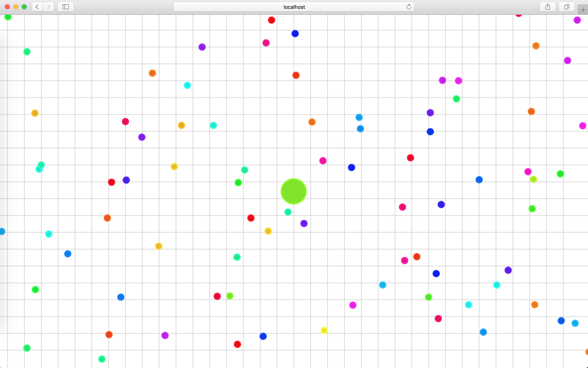

# Simple-Agar.io

This is a very simple implementation of Agar.io. My primary purposes of building this project is to learn more about socket and
practice my NodeJS skills. Therefore, this project have a very simple gameplay (unlike the original version) but focus more
on socket connection client and server as well as the implementation of the game architecture. All other features can be added 
later if I have more time or if any one want to copy and improve this project.

This simple project is built with socket.io, NodeJS and HTML5 canvas



## Gameplay
The game play is very simple: just go to the site and you will automatically be in the game with your character.
* You can only move around and eat your food and the other players
* There are currently no split or green circle where you can be split if you reach certain mass

Other rules: 
* Currenly, the number of food is a constant. After 1s, new food will respawn to replace food that has been eaten.
* The game screen is 5000 * 5000 by default.
* All the variable is able to be changed in src/config/config.js

## Some features
* The client only render players and food. All the logics are in server
* This project employs quadtree to reduce the complexity for collision detection and reduce number of entities to be rendered
by the client

## Install
**Downloading the dependencies**

```
npm install
```

**Running the server**

```
npm start
```

**Deploying gulp watch for development**

```
gulp watch
```